# ピボットテーブル
複数データフレームをマージ後にピボットテーブルで様々な角度から集計を行う

<br>

## 取引概要データのデータフレームを表示
```
frame1
```
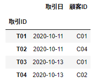

<br>

## 取引詳細データのデータフレームを表示
```
frame2
```
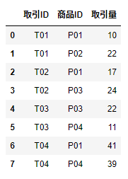

<br>

## 商品データのデータフレームを表示
```
frame3
```
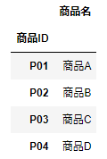

<br>

## 顧客データのデータフレームを表示
```
frame4
```
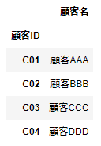

<br>

## 取引詳細データに取引概要データをマージ
```
frame2 = pd.merge(frame2, frame1, how='left', on='取引ID')
```
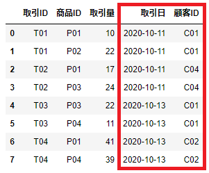

<br>

## 取引詳細データに顧客データをマージ
```
frame2 = pd.merge(frame2, frame4, how='left', on='顧客ID')
```
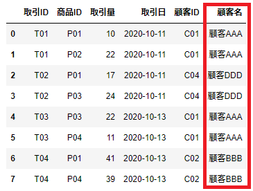

<br>

## 取引詳細データに商品データをマージ
```
frame2 = pd.merge(frame2, frame3, how='left', on='商品ID')
```
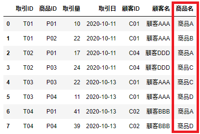

<br>

## 取引詳細データに索引設定
```
frame2.set_index(['取引ID', '商品ID'])
```
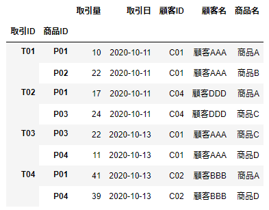

<br>

## 列(取引日)、行(商品名)のグループで取引量を集計(集計関数は合計を使用)
```
frame2.pivot_table(values='取引量', index='商品名', columns='取引日', aggfunc=np.sum)
```
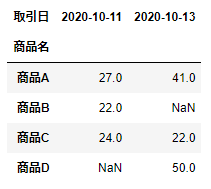

<br>

## 列(商品名)、行(取引日)のグループで取引量を集計(集計関数は合計を使用)
```
frame2.pivot_table(values='取引量', index='取引日', columns='商品名', aggfunc=np.sum)
```
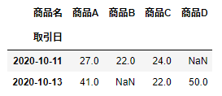

<br>

## 列(取引日)、行(顧客名)のグループで取引量を集計(集計関数は合計を使用)
```
frame2.pivot_table(values='取引量', index='顧客名', columns='取引日', aggfunc=np.sum)
```
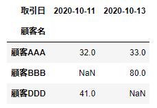

<br>

## 列(顧客名)、行(取引日)のグループで取引量を集計(集計関数は合計を使用)
```
frame2.pivot_table(values='取引量', index='取引日', columns='顧客名', aggfunc=np.sum)
```
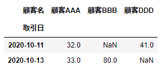

<br>
